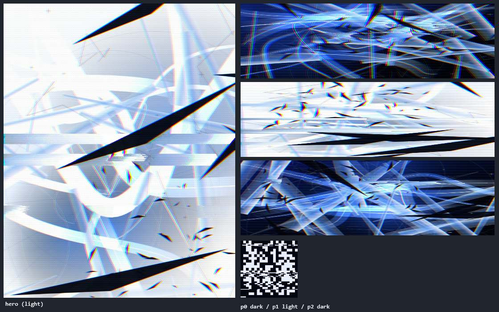

# danielproject

Portfolio personal en una sola página. Estética neo-Y2K / FUI, referencia The Designers Republic
(WipEout), Evangelion UI y collage glitch tipo dove+choco.



## Qué hay aquí

| Archivo | Qué es |
| --- | --- |
| `index.html` | La página. Único archivo que se edita. |
| `support.js` | Runtime de Claude Design (React por debajo). **Generado — no editar.** |

Se llama `index.html` para que Vercel la sirva en la raíz sin configuración. En Claude
Design el mismo archivo vive como `Portfolio Y2K.dc.html` — el nombre local y el remoto son
independientes, y el contenido es idéntico.

Ese contenido es un `.dc.html`, formato de Claude Design: una plantilla `<x-dc>` con bindings `{{ }}`,
`<sc-if>`, `<sc-for>` y `<helmet>`, más un `<script data-dc-script>` con una clase
`Component extends DCLogic` cuyo `renderVals()` devuelve los valores de la plantilla.

Cualquier edición debe preservar ese formato intacto — incluido el JSON de `data-props`
con entidades `&quot;` válidas al decodificar — para que el archivo siga siendo
re-importable en Claude Design.

## Verlo

`support.js` carga React desde unpkg, así que basta con servir la carpeta:

```bash
python -m http.server 8791
```

Y abrir `http://localhost:8791`. No hay build ni dependencias que instalar.

## Deploy

Es estático puro: la raíz del repo se publica tal cual, sin `vercel.json`, sin build step.

```bash
vercel --prod
```

## Props editables

Desde el panel de Claude Design, o pasándolos al componente:

| Prop | Tipo | Default | Qué hace |
| --- | --- | --- | --- |
| `scanlines` | bool | `true` | Líneas de barrido sobre las secciones |
| `halftone` | bool | `true` | Trama de puntos con máscara de degradado |
| `plates` | bool | `true` | Imaginería chrome generada en canvas |
| `cursor` | bool | `true` | Retículo FUI en lugar del cursor del sistema |
| `ghostWord` | text | `ADRIFT` | Palabra gigante de fondo |
| `ticker` | text | … | Texto del marquee "fracture mode" |

## Sistema visual

**Color** — `DEEP #03060e`, `INK #08123a`, fondo claro `#f4f7fc`, `STEEL #9db8dc`,
`PALE #e6effb`, acento `BLUE #0102ec`.

**Tipografía** — Space Grotesk (display), IBM Plex Mono (telemetría, terminal, microtexto),
Archivo variable con eje de ancho 62–125% para el contraste condensada/expandida de tDR.

**Devices** — `.telemetry`, `.terminal-log` (+ `.boot`), `.corner-brackets`, `.ghost-type`,
`.crosshair`, `.reg-mark`, `.microtext`, `.scanline-overlay`, `.halftone-overlay`, `.grid-bg`,
`.barcode`, `.hatch`, `.kagi`, `.ruler`, `.justified`, `.ticker`, `.rgb-split`, `.draw-x`,
`.glitch-hover`, `.blink`, `.aug-card`. Esquinas recortadas con
[augmented-ui v2](https://augmented-ui.com/) por CDN.

## Las placas

La imaginería no son assets: se genera en canvas al cargar, una vez, y se sirve como blob URLs.
El generador (`ART` dentro del script) compone degradados, luz radial, cintas de vidrio con
núcleo especular, facetas duras, retícula radial y esquirlas de tinta negra; después aplica
dither Bayer 4×4, RGB split, pixel sort por luminancia e interlace. Cada placa es determinista
por semilla.

El hero se hornea en **dos capas** — render y tinta — que derivan una contra otra con parallax
de scroll y un rasgón ocasional. Como una capa aislada no recibe fringe del RGB split (no hay
nada detrás de donde jalar color), el borde magenta/cian de las esquirlas se pinta a mano.

Coste: ~125 ms el hero, ~132 ms el resto, encadenados para que ninguna tarea bloquee el paint.

## Reglas de rendimiento

Son la razón de que el archivo esté escrito así. No las rompas:

- Animar **sólo** `transform` y `opacity`. Nada de `filter: blur()` ni `mix-blend-mode` en
  capas animadas.
- Los efectos caros se hornean una vez en canvas al cargar.
- Patrones de fondo animados: mover con `transform`, nunca con `background-position`.
- `prefers-reduced-motion` apaga toda la animación, y nada debe quedar invisible cuando lo hace.

Esa última regla es literal: si algo arranca en `opacity: 0` o `scaleX(0)` esperando una
animación, tiene que existir una salida que lo deje en su estado final sin depender de que corra
el frame loop. Una página renderizada oculta (captura de thumbnail, pestaña en segundo plano)
no ejecuta el ciclo de render, y sin esa salida el contenido simplemente no aparece.

## Pendientes

- Copy real: 001 es [fracture](https://github.com/danielzam0407/fracture), pero 002 y 003
  siguen siendo ficticios y `hello@daniel.mx` es placeholder.
- Stills reales de los proyectos, para que el pipeline los procese en vez de generar desde cero.
- La fuente LEDLIGHT (Billy Argel) es gratis sólo para uso personal. Para uso comercial hay que
  licenciarla, o recrear el efecto con un filtro SVG sobre una fuente libre.
- Las fuentes de WipEout que circulan en GitHub son las de tDR extraídas del juego, sin licencia.
  No usarlas.

## Proyecto hermano

`Presentacion Personal.dc.html` + `animations-v3.jsx` + `daniel-scene.jsx` — pieza de animación
16:9 con el mismo universo visual, vive en el proyecto de Claude Design.
